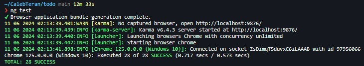
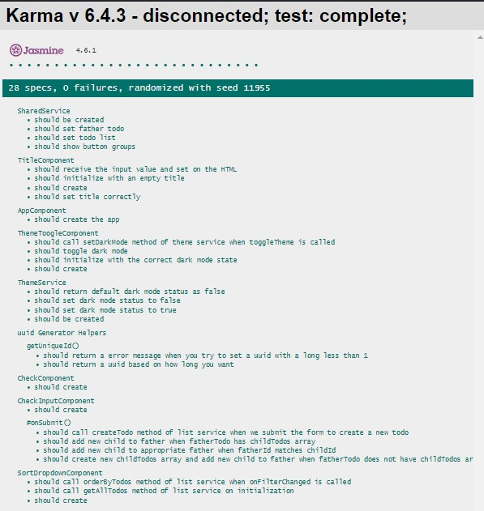
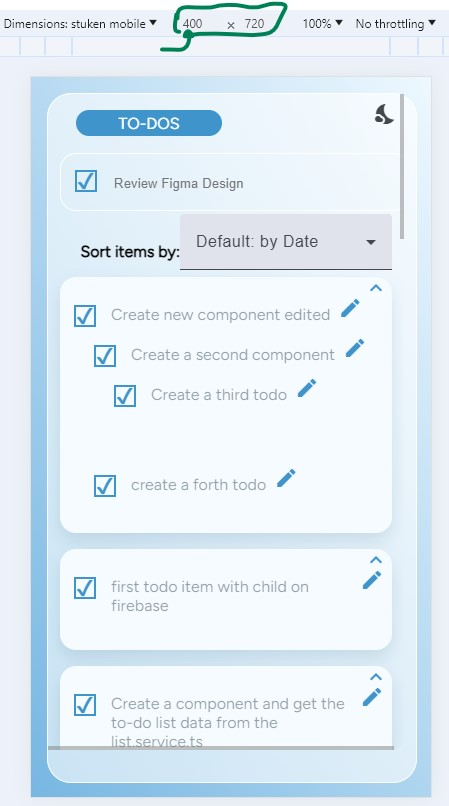
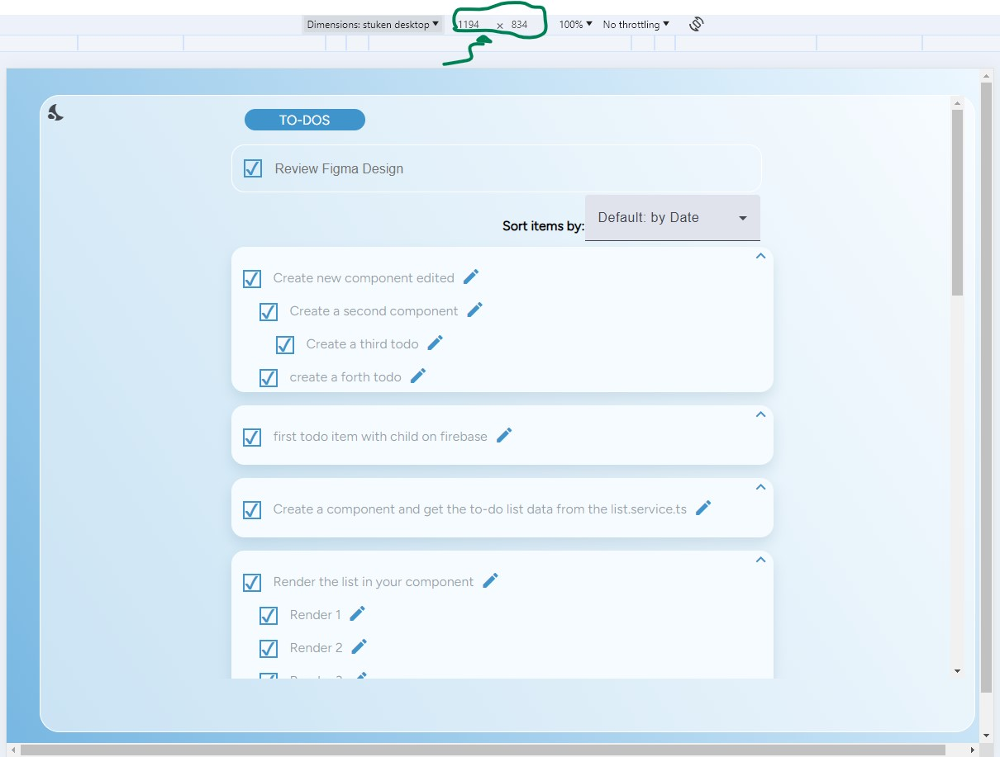
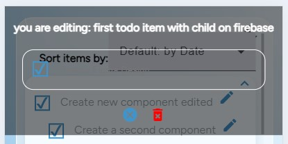
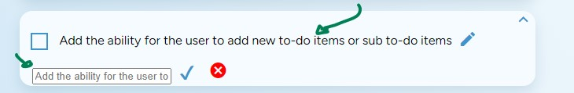

# TodoStukent Take Home Interview Project

## Development server

For run this project you can run `ng serve`and see it on the preview page at your left.

## Structure
- SRC : is our main folder
  - App: folder where our app works
    - Core: Here we have interfaces, Services 
        - Interfaces
        - Services
    - Enviroments: Configuration of env to use firebase 
    - Mocks: Mock data to use for testing
    - Modules: modules of the app
        - Todo: our unique module or page    
    - Shared: folder where our app works 
        - helpers: Folder with function with possible repetitive logic of our app
        - components: Components for use in multiple other components.

## Running unit tests

For run testing you can run `ng test` command (not all the components are tested).

then on your right side you'll see

## About the design
### Resolutions acording to the figma design
Remember to apply this resolutions `400 x 720` for mobile and `1194 x 834` for desktop

### Theme and on edit item
When you click on the `moon` or `sun` icons you going to change between light and dark mode

For edit an item you shoul click on the pen icon on the item you want to add a child or remove then you'll see a square on you top to add childs or remove

to modify a title you just need to click over the Text that you want to modify then you'll see an input to change it and an icon to complete or cancel the action (this just work for fathers not with childs)
